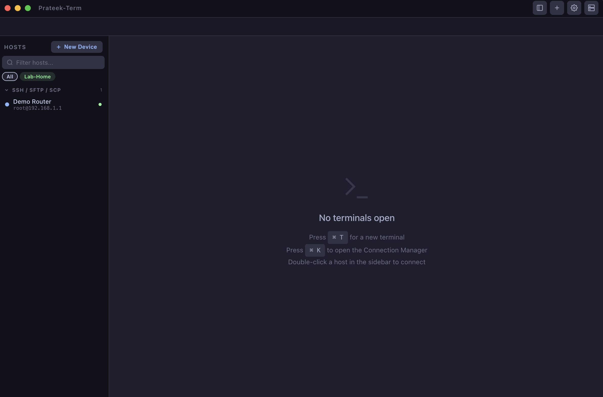

<h1 align="center">Prateek-Term</h1>

<p align="center">
  <strong>A modern macOS terminal with SSH, Serial, SFTP &amp; native MCP support for AI agents</strong>
</p>

<p align="center">
  <a href="https://github.com/tripathiprateek/prateek-term/releases"></a>
  
  
  <a href="https://polyformproject.org/licenses/noncommercial/1.0.0/"></a>
</p>

<p align="center">
  
</p>

---

## The first macOS terminal with native MCP support

Prateek-Term is more than a terminal emulator. It exposes **11 MCP tools** that let AI agents (Claude Desktop, Claude Code, or any MCP client) connect to SSH devices, run commands, transfer files, and manage sessions — all through a standardized protocol.

No plugins. No wrappers. Built in.

---

## Features

### Terminal
- **xterm.js** with 256-color / true-color support, Catppuccin Mocha theme
- **Multi-tab** (`Cmd+T`) and **multi-window** (tear off any tab)
- **Bracketed paste** for safe multi-line input
- **Middle-click paste** from clipboard

### SSH / Serial / File Transfer
- **SSH** with PEM/identity file support, custom SSH options, ssh-config import/export
- **Telnet** with configurable host, port, and options
- **SFTP** with PEM support and drag-and-drop file upload from Finder
- **SCP** with legacy protocol support (`-O` flag) for embedded/BusyBox devices
- **FTP** interactive client
- **Serial** with configurable baud rate, data bits, stop bits, parity

### Connection Manager
- Save, edit, and organize connection profiles per protocol
- **Custom Actions** — define per-profile scripts that execute instantly in the terminal
- Export / Import profiles and actions as JSON

### MCP for AI Agents

11 tools available over stdio transport:

| Tool | Description |
|------|-------------|
| `list_profiles` | List all saved connection profiles |
| `list_sessions` | List active terminal sessions |
| `connect` | Open an SSH/Telnet/Serial session by profile name |
| `run_command` | Execute a command in a session and wait for output |
| `send_input` | Send raw input to a session (for prompts, passwords) |
| `read_output` | Read the latest output from a session |
| `disconnect` | Close a session |
| `get_status` | Get the current state of a session |
| `upload_file` | Upload a local file to a remote host via SCP |
| `download_file` | Download a remote file to local via SCP |
| `list_serial_ports` | List available serial ports on the host |

---

## Quick Start

### Install

Download the latest DMG from [Releases](https://github.com/tripathiprateek/prateek-term/releases), open it, and drag Prateek-Term to Applications.

### Enable MCP

1. Open Prateek-Term
2. Go to **Settings** (gear icon) and click **Register MCP Server**
3. Restart Claude Desktop or Claude Code

That's it. Claude can now see and use Prateek-Term's MCP tools.

### Example: AI-driven SSH session

```
Claude: "Connect to my staging server and check disk usage"

→ connect(profileName: "staging-server")
→ run_command(session_id: "1", command: "df -h")
→ Returns formatted disk usage output
```

---

## Development

```bash
npm install          # install dependencies
npm start            # run in development mode
npm test             # run test suite (175 tests)
npm run lint         # lint source
```

### Build

```bash
npm run dist:arm64   # builds DMG + ZIP for Apple Silicon
```

## Requirements

- macOS 12+ (Apple Silicon / arm64)
- Node.js 18+

---

## License

[PolyForm Noncommercial License 1.0.0](https://polyformproject.org/licenses/noncommercial/1.0.0/)

For commercial licensing, contact: tripathiprateek@gmail.com

## Author

**Prateek Tripathi** — [tripathiprateek@gmail.com](mailto:tripathiprateek@gmail.com)
