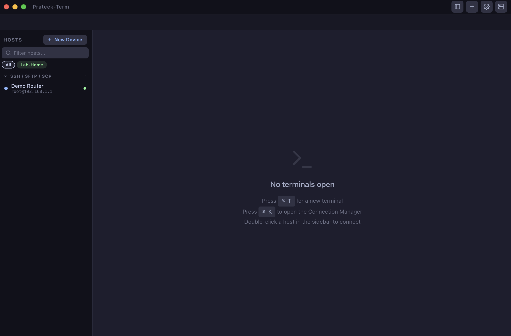

<h1 align="center">Prateek-Term</h1>

<p align="center">
  <strong>A modern cross-platform terminal with SSH, Serial, SFTP &amp; native MCP support for AI agents</strong>
</p>

<p align="center">
  <a href="https://github.com/tripathiprateek/prateek-term/releases"></a>
  
  <a href="https://polyformproject.org/licenses/noncommercial/1.0.0/"></a>
</p>

<p align="center">
  
</p>

---

## A cross-platform terminal with native MCP support

Prateek-Term is more than a terminal emulator. It exposes **13 MCP tools** that let AI agents (Claude Desktop, Claude Code, or any MCP client) connect to SSH devices, run commands, transfer files, add/remove profiles, and manage sessions — all through a standardized protocol.

No plugins. No wrappers. Built in.

---

## Features

### Terminal
- **xterm.js** with 256-color / true-color support, Catppuccin Mocha theme
- **Multi-tab** (`Cmd+T`) and **multi-window** (tear off any tab)
- **Tab groups** — tabs auto-grouped by connection tags (HOME, AWS, etc.) with colored labels; drag tabs between groups, collapse/expand groups
- **Bracketed paste** for safe multi-line input
- **Middle-click paste** from clipboard

### SSH / Serial / File Transfer
- **SSH** with PEM/identity file support, custom SSH options, ssh-config import/export
- **Jump Host (ProxyJump)** — tunnel through an intermediary SSH host (agent, key, or password auth)
- **Cloudflare Access** — zero-trust SSH tunnelling via `cloudflared`, with a sign-in preflight: if no valid Access token is cached it offers a one-click browser login before connecting
- **Port forwarding** — local / remote / dynamic (SOCKS5), with one-click **Launch Chrome via this proxy** and per-rule Include/Exclude host filtering
- **Telnet** with configurable host, port, and options
- **SFTP** with PEM support and drag-and-drop file upload from Finder
- **SCP** with legacy protocol support (`-O` flag, `ssh-rsa`) for embedded/BusyBox/dropbear devices
- **FTP** interactive client
- **Serial** with configurable baud rate, data bits, stop bits, parity

### Connection Manager
- Save, edit, and organize connection profiles per protocol
- **Duplicate profile** — right-click any host → **Duplicate** to clone it with every detail (host, port, username, password, key, actions, tags, and all options) under a suggested unique name
- **Collapsible sidebar** (`⌘B` / `Ctrl+B`) — state persists across restarts
- **Custom Actions** — define per-profile scripts that execute instantly in the terminal
- Export / Import profiles and actions as JSON
- **Per-profile AI toggle** — click the AI chip on any sidebar profile to grant or revoke AI/MCP access; no special tags needed

### MCP for AI Agents

13 tools available over stdio transport:

| Tool | Description |
|------|-------------|
| `list_profiles` | List all saved connection profiles |
| `list_sessions` | List active terminal sessions |
| `connect` | Open an SSH/Telnet/Serial session by profile name |
| `run_command` | Execute a command in a session and wait for output |
| `send_input` | Send raw input to a session (for prompts, passwords) |
| `read_output` | Read the latest output from a session |
| `disconnect` | Close a session |
| `get_status` | Get the current state of a session |
| `upload_file` | Upload a local file to a remote host via SCP |
| `download_file` | Download a remote file to local via SCP |
| `list_serial_ports` | List available serial ports on the host |
| `add_profile` | Create a new connection profile (AI access off by default) |
| `remove_profile` | Delete a profile (refuses if sessions active unless `force`) |

---

## Quick Start

### Install

**macOS** (Apple Silicon)

```sh
brew tap tripathiprateek/prateek-term
brew trust tripathiprateek/prateek-term      # Homebrew 6+ requires trusting third-party cask taps
brew install --cask prateek-term
```

**Linux** (x64 / ARM64)

```sh
curl -fsSL https://raw.githubusercontent.com/tripathiprateek/prateek-term/main/install.sh | sh
```

No `curl`? Stock Ubuntu Desktop ships only `wget`:

```sh
wget -qO- https://raw.githubusercontent.com/tripathiprateek/prateek-term/main/install.sh | sh
```

**Windows** (x64 / ARM64)

```powershell
scoop bucket add prateek-term https://github.com/tripathiprateek/scoop-prateek-term
scoop install prateek-term
```

<details>
<summary>Release candidates, options and uninstalling</summary>

Release candidates ship from a separate channel. Installing one opts you in —
you keep getting RCs, and the final release when it lands.

```sh
brew install --cask prateek-term@rc                                  # macOS
curl -fsSL .../install.sh | sh -s -- --channel rc                   # Linux
scoop install prateek-term-rc                                       # Windows
```

The Linux script takes `--channel stable|rc`, `--version vX.Y.Z`, `--with-deps`
and `--uninstall`. `--with-deps` also installs the optional CLI tools the app
shells out to — `sshpass` (password jump hosts), `nodejs` (MCP server) and
`cloudflared` (Cloudflare Access) — which needs `sudo`, so run it from a real
terminal rather than through a pipe:

```sh
sh -c "$(wget -qO- https://raw.githubusercontent.com/tripathiprateek/prateek-term/main/install.sh)" -- --with-deps
``` Arguments must come after `-s --`, because the script is being
piped into `sh`:

```sh
curl -fsSL .../install.sh | sh -s -- --uninstall
```

No Scoop? There is a PowerShell equivalent. `irm | iex` cannot take parameters,
so pass them via a scriptblock:

```powershell
irm https://raw.githubusercontent.com/tripathiprateek/prateek-term/main/install.ps1 | iex
& ([scriptblock]::Create((irm https://raw.githubusercontent.com/tripathiprateek/prateek-term/main/install.ps1))) -Channel rc
```

**Gatekeeper.** The app is ad-hoc signed but not notarized (no paid Apple
Developer account), so macOS may refuse the first launch. Homebrew 6 removed the
old `--no-quarantine` flag, so if that happens:

```sh
xattr -dr com.apple.quarantine /Applications/Prateek-Term.app
```

or right-click the app → Open → Open. Verify your download against the
`SHA256SUMS` published with every release.

**Windows and SmartScreen.** The app is unsigned, so the `.exe` installer
triggers "Windows protected your PC". Scoop and `install.ps1` extract a zip
rather than launching a downloaded executable, so neither hits SmartScreen.

**macOS is Apple Silicon only.** The cask declares `depends_on arch: :arm64`, so
Intel Macs get a clear error rather than an app that cannot launch.

</details>

Prefer to download by hand? Grab a build from
[Releases](https://github.com/tripathiprateek/prateek-term/releases):

| Platform | File | Notes |
|----------|------|-------|
| **macOS** (Apple Silicon) | `.dmg` | Open it, drag Prateek-Term to Applications. Ad-hoc signed — if Gatekeeper warns, right-click → Open → Open anyway. |
| **Windows** | `Setup .exe` (installer) or portable `.exe` | Unsigned — on the SmartScreen prompt click **More info → Run anyway**. |
| **Linux** | `.AppImage` (any distro) or `.deb` (Debian/Ubuntu) | `chmod +x *.AppImage && ./*.AppImage`, or `sudo dpkg -i *.deb`. The `.deb` is not managed by the install script: under dpkg an RC sorts as *newer* than the final release, so apt would refuse the upgrade. |

After install you can register the OS integration ("Open in Prateek-Term") from **Settings**: a Finder Quick Action on macOS, a right-click folder menu on Windows, and a `.desktop` entry + `prateekterm://` handler on Linux.

### Enable MCP

1. Open Prateek-Term
2. Go to **Settings** (gear icon) and click **Register MCP Server**
3. Restart Claude Desktop or Claude Code
4. Click the **AI** toggle on any profile in the sidebar to grant AI/MCP access to it (grey = off, green = on)

That's it. Claude can now connect to profiles with AI access enabled.

### Example: AI-driven SSH session

```
Claude: "Connect to my staging server and check disk usage"

→ connect(profileName: "staging-server")
→ run_command(session_id: "1", command: "df -h")
→ Returns formatted disk usage output
```

---

## Development

```bash
npm install          # install dependencies
npm start            # run in development mode
npm test             # run test suite (729 tests)
npm run lint         # lint source
```

### Build

Native modules (`node-pty`, `serialport`) can't be cross-compiled — build each OS on that OS:

```bash
npm run dist          # macOS  → .dmg + .zip
npm run dist:win      # Windows → NSIS installer + portable .exe (x64, arm64)
npm run dist:linux    # Linux  → AppImage + .deb (x64, arm64)
```

CI builds all three in a matrix (`.github/workflows/ci.yml`) and attaches every artifact to the GitHub Release on a `v*` tag.

## Requirements

- macOS 12+ / Windows 10+ / a modern Linux desktop
- Node.js 18+

### Platform notes

- **SSH password auth** works everywhere via in-terminal auto-type.
- **SCP/SFTP password auth** (drag-drop upload, MCP `upload_file`) needs `sshpass`, which doesn't exist on Windows — use **key-based auth** there. macOS/Linux are unaffected.
- **Linux file-manager "open here"** integration varies by desktop environment; the `.desktop` entry + `prateekterm://` handler are installed automatically, per-DE context-menu actions may need a manual step.

---

## License

[PolyForm Noncommercial License 1.0.0](https://polyformproject.org/licenses/noncommercial/1.0.0/)
